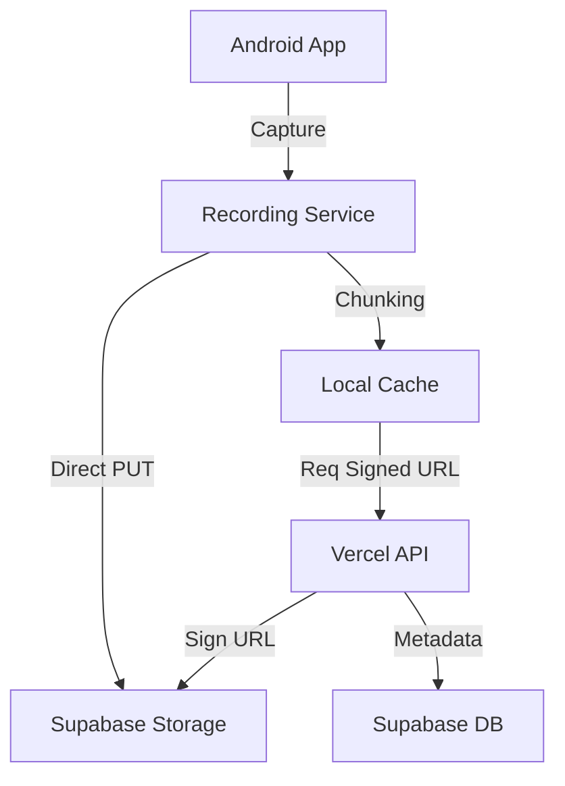

# 🛡️ Elysium Vanguard Record Shield

> **Anti-sabotage emergency recording system with real-time cloud evidence preservation.**

[](https://kotlinlang.org)
[](https://developer.android.com/jetpack/compose)
[](https://vercel.com)
[](https://supabase.com)

---

## 🎯 What Is This?

Record Shield captures audio and video evidence and uploads it to the cloud **in real-time fragments (every 10 seconds)**. Even if the device is destroyed, confiscated, or the screen is locked, the recording process continues uninterrupted, and previously uploaded segments remain secure in Supabase Storage.

### Key Features

- 🔴 **1-Click Recording** — Instant start/stop with minimal latency.
- 🔒 **Zero-Interruption Background Video** — Continuous recording even when the screen is off or locked via "Mock Surface Persistence".
- ☁️ **Real-Time Cloud Sync** — Fragments uploaded via Vercel-mediated signed URLs to Supabase.
- 📱 **Anti-Sabotage Lock** — PIN-protected UI; back button and system gestures disabled during active recording.
- 🎨 **Premium Neo-Futuristic UI** — Matrix-inspired animations, glassmorphism, and high-contrast dark theme.
- 🎬 **Internal Secure Gallery** — Encrypted local storage; playback is PIN-gated.

---

## 🏗 Architecture



---

## 📂 Project Structure

- **`/android`**: Jetpack Compose application.
  - `RecordingService`: Handles foreground lifecycle, CameraX integration, and background persistence.
  - `EvidenceUploadRepository`: Manages the direct-to-cloud upload pipeline.
- **`/vercel`**: API Gateway for security and metadata registration.
  - `/api/get-upload-url`: Generates pre-signed Supabase URLs.
  - `/api/register-chunk`: Finalizes metadata in the database.
- **`/supabase`**: Database schema and storage bucket configuration.

---

## 🚀 How to Build & Compile

### Prerequisites

- Android Studio Ladybug (or newer)
- JDK 17+
- Vercel CLI (for backend deployment)

### 1. Backend Setup

1. Deploy the Supabase schema from `supabase/migrations/001_init_evidence_schema.sql`.
2. Deploy the Vercel project:

    ```bash
    cd vercel
    vercel --prod
    ```

3. Configure environment variables in Vercel: `SUPABASE_URL`, `SUPABASE_SERVICE_ROLE_KEY`.

### 2. Android App Compilation

1. Open the `android` folder in Android Studio.
2. Sync Gradle dependencies.
3. Build the APK:

    ```bash
    ./gradlew assembleDebug
    ```

4. Install the generated APK on your device.

---

## 🔐 Security Model

| Component | Description |
|-----------|-------------|
| **Transmission** | TLS 1.3 / HTTPS for all cloud communication. |
| **Integrity** | SHA-256 hashing for every evidence chunk. |
| **Persistence** | Foreground Service + WakeLock ensures recording doesn't stop on screen lock. |
| **Isolation** | Evidence stored in `filesDir` (internal) - invisible to other apps or gallery. |

---

## 📋 Development Status

- [x] **Phase 1-4:** core infrastructure and UI.
- [x] **Phase 5.1:** Zero-Interruption Background Recording (FIXED).
- [x] **Phase 6:** Direct Cloud Sync with Vercel/Supabase (FIXED).

---

## 🤝 Credits & Development

**Lead Developer & Visionary:** [Jordelmir](https://github.com/jordelmir)

Special thanks to the Elysium Vanguard engineering workflow for the high-end implementation of the Zero-Interruption recording logic and the secure cloud synchronization pipeline.

---

## 📄 License

Proprietary — All rights reserved.

---

*Built with the highest engineering standards. Zero shortcuts. Zero garbage code.*
